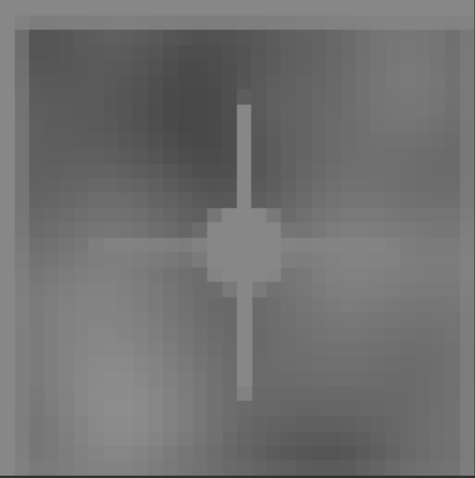

  

# Hindsight

An interactive web-based simulator that demonstrates how optical mouse sensors work using real-time motion detection algorithms.

## Features

- **Real-time Motion Detection**: Advanced optical flow estimation with sub-pixel accuracy
- **Feature-based Tracking**: Corner detection and template matching for improved accuracy
- **Interactive Visualization**: See the sensor view and motion tracking in real-time
- **Configurable Settings**: Adjust sensor resolution, noise, blur, and other parameters
- **Performance Metrics**: Monitor tracking accuracy and frame rate

## How It Works

The simulator captures a small region (sensor view) around the mouse cursor and tracks motion between frames using:

1. **Feature Detection**: Identifies distinctive corners and patterns in the sensor view
2. **Motion Estimation**: Uses a multi-phase approach:
   - Feature-based tracking for textured surfaces
   - Block matching as fallback
   - Sub-pixel refinement for accuracy
3. **Temporal Smoothing**: Reduces jitter and provides stable tracking

## Controls

- Move your mouse over the surface canvas to simulate optical tracking
- Adjust settings in real-time to see how they affect accuracy:
  - **Sensor Resolution**: Size of the sensor view (16-64 pixels)
  - **Search Radius**: Maximum motion detection range
  - **Noise/Blur**: Simulate real-world sensor imperfections
  - **Grayscale/Threshold**: Test different preprocessing methods

## Technical Implementation

- **Motion Detection**: Hybrid approach combining feature tracking and block matching
- **Sub-pixel Accuracy**: Bilinear interpolation for precise motion estimation
- **Performance**: Optimized sampling for real-time 60 FPS operation
- **Visualization**: Separate views for surface, sensor, and tracking results

## Usage

Open `index.html` in a modern web browser and move your mouse over the surface area. The red box shows the estimated position while the green box shows the true position. The sensor view displays what the optical mouse "sees" at a magnified scale.

## Accuracy Improvements

This simulator includes several enhancements over basic optical flow:
- Multi-resolution feature detection
- Confidence-based tracking
- Adaptive search strategies
- Temporal filtering for stability

The result is significantly improved tracking accuracy, especially for slow movements and textured surfaces.